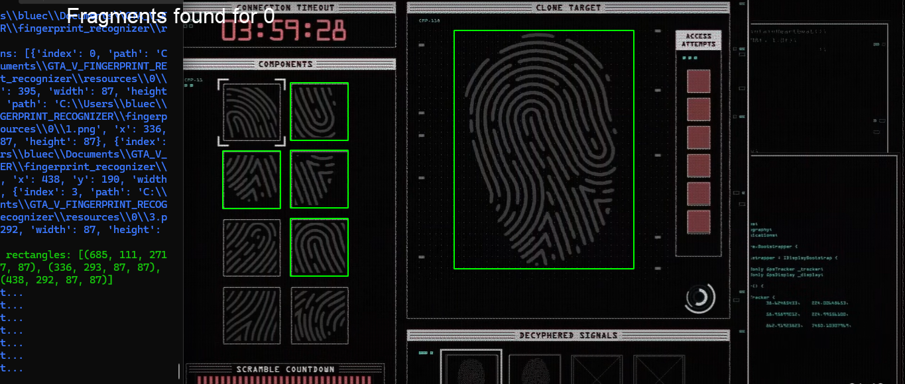
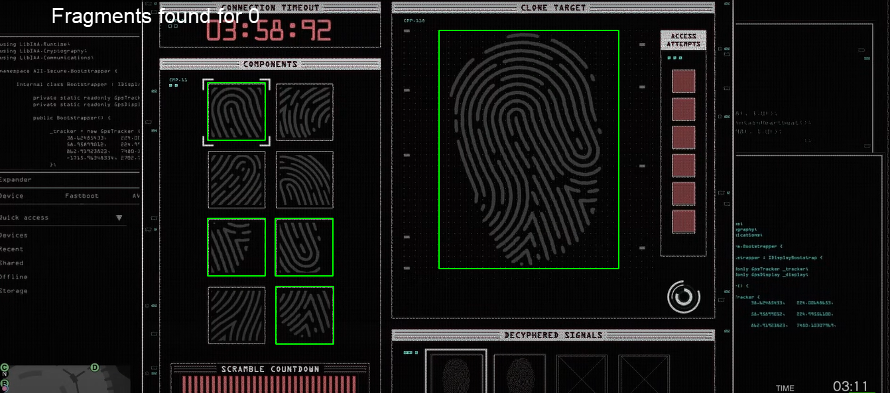
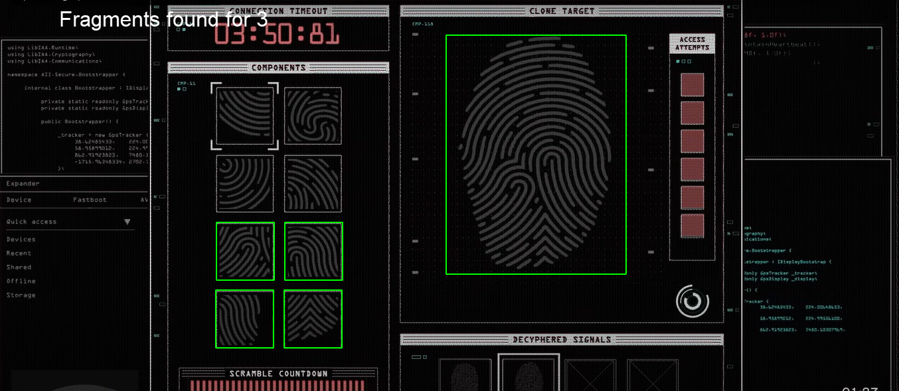
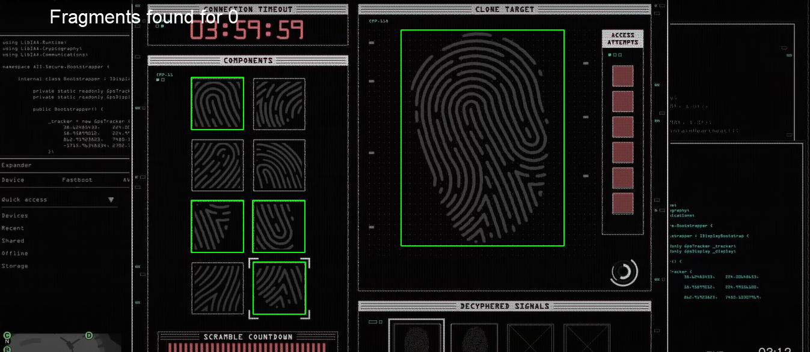

**### GTA-V-HEIST-VAULT-HELPER**

**#Do you like making the fingerprint hacks in GTA V?**
**#_I do! (but I know, you don't)_ That's why I made a program, that does that for you.**

**##How should it work?**

**### USAGE: **
It is a program, originally written in **Python 3.11.7**, but as I know, it works in any version greater than **3.9** (**>3.9**)

**#Start the program by running, the _start.bat_**
It automatically creates a virtual enviroment _(.env)_ and installs the requirements

In case, something goes wrong, you can setup yourself by running:
#pip install -r requirements.txt

You can run the program by python main.py --headless
    _(because the regular UI (tui) is buggy)_

In case something goes wrong, write me, file an issue, you'll get it fixed.